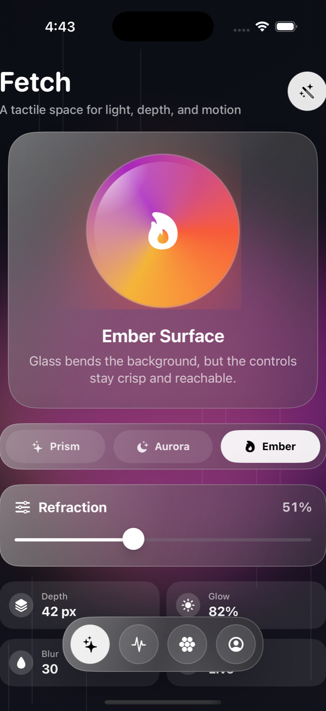
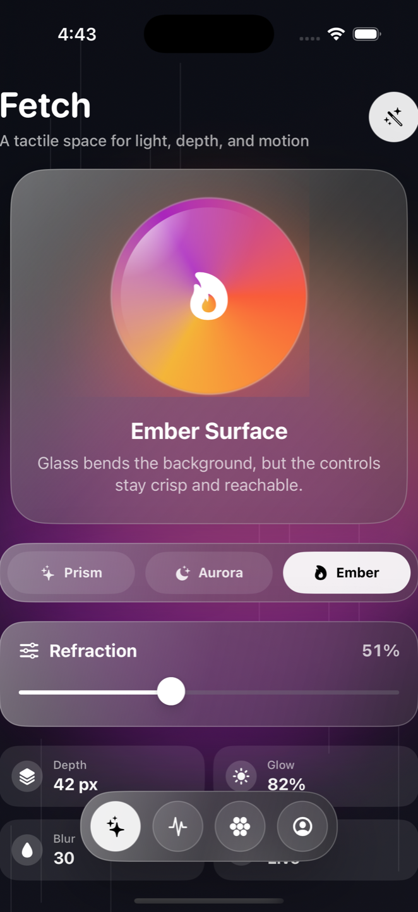
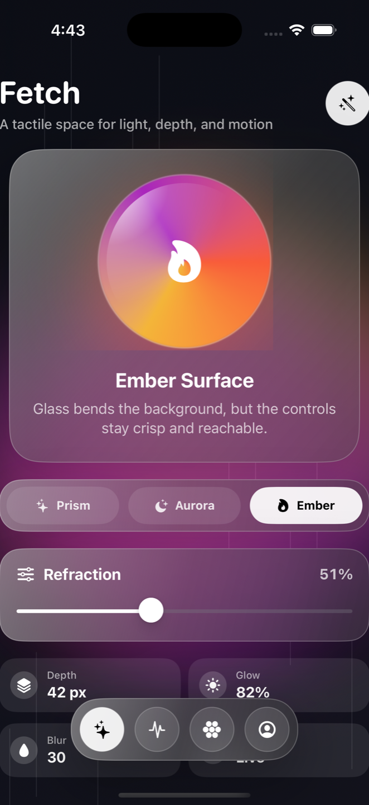

# Fetch

Fetch is a native SwiftUI iOS app exploring a liquid glass interface concept with animated color fields, translucent material panels, tactile controls, and a floating glass dock.

## Screenshots





## Requirements

- Xcode 16.4 or newer
- iOS 17.0 or newer deployment target

## Quick Start

1. Clone this repository.
2. Open `Fetch.xcodeproj` in Xcode.
3. Select the `Fetch` scheme.
4. Pick an iPhone simulator (for example, iPhone 16 Pro).
5. Press Run.

## Command-Line Build Check

Use this when you want a quick local compile validation:

```sh
xcodebuild -project Fetch.xcodeproj -scheme Fetch -sdk iphonesimulator -derivedDataPath ./DerivedData CODE_SIGNING_ALLOWED=NO build
```

## Troubleshooting

- If Xcode fails after moving the repo path:
  remove local build cache and build again:
  `rm -rf DerivedData`
- If simulator install or launch fails:
  confirm the simulator is booted in Xcode and run once from Xcode UI.
- If build succeeds but preview or simulator appears stale:
  clean build folder in Xcode and rerun.

## Project Structure

- `Fetch/FetchApp.swift`: app entry point
- `Fetch/ContentView.swift`: main SwiftUI screen and interactions
- `Fetch/GlassComponents.swift`: reusable liquid glass visual components

## Notes

Build artifacts and local Xcode state are excluded via `.gitignore`.
